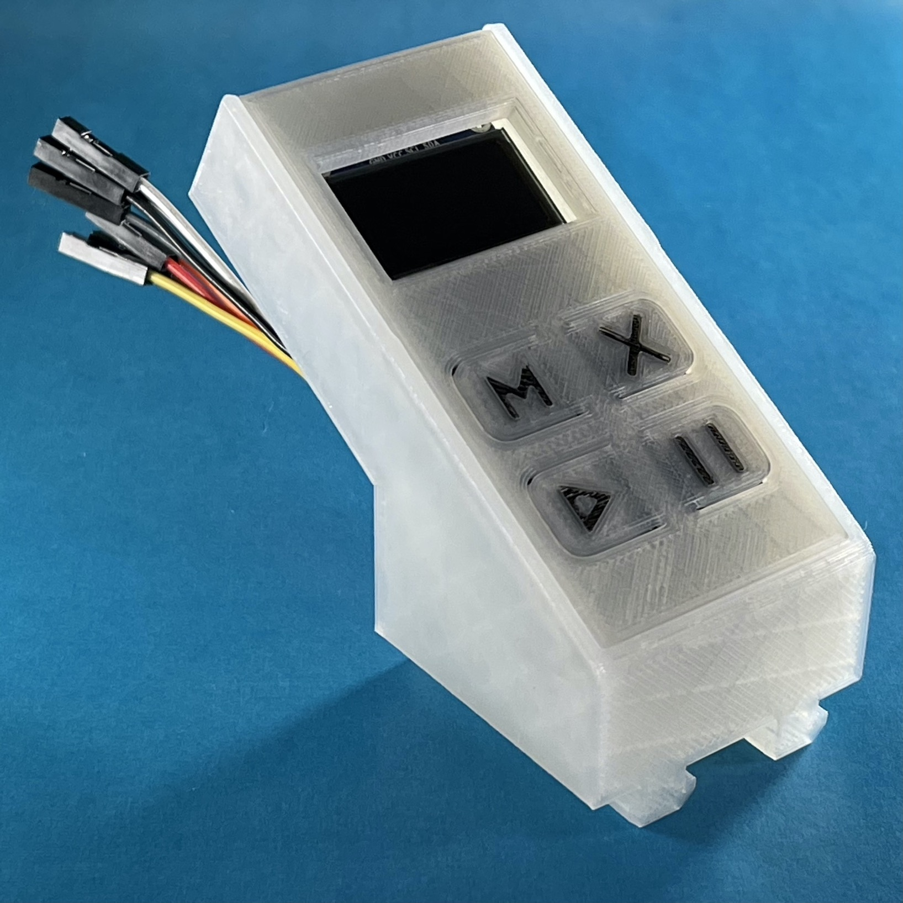
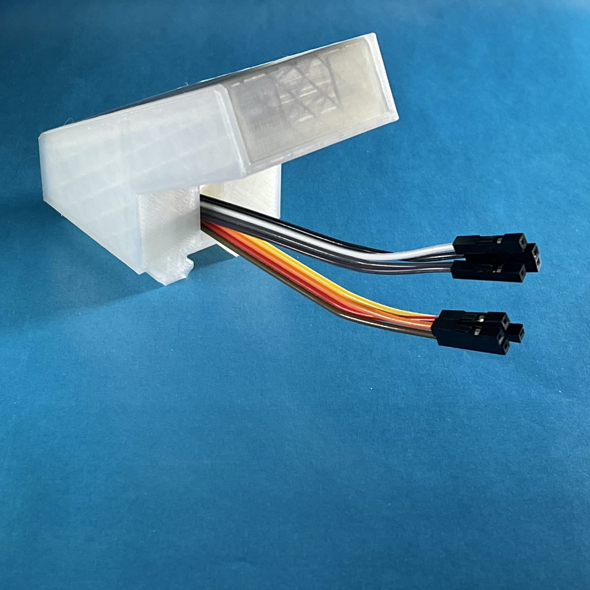
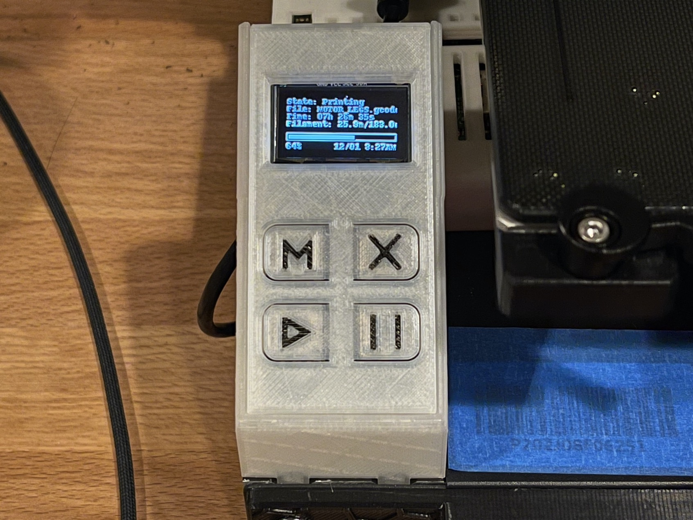

# OctoPrint-DisplayPanel

This plugin implements the software control side of an OctoPrint Control Panel for Octopi. The hardware half is a series of 4 buttons, an OLED screen and a 3D printed case that mounts on the printer next to the Raspnerry Pi so it can be plugged in to the header pins.

The 3D files can be [found on Thingiverse](https://www.thingiverse.com/thing:4674214).





## Setup

**NOTE:** This plugin required OctoPrint to be updated to run on Python 3. Please follow [these instructions](https://community.octoprint.org/t/upgrade-your-octoprint-install-to-python-3/23973) if you are not already on Python 3.

Install via the bundled [Plugin Manager](https://docs.octoprint.org/en/master/bundledplugins/pluginmanager.html)
or manually using this URL:

    https://github.com/sethvoltz/OctoPrint-DisplayPanel/archive/master.zip

Before installation, you will need to `pip` install a few dependencies. Please ensure you are using the `virtualenv` bundled version:

    ```sh
    ~/oprint/bin/pip install pillow
    ~/oprint/bin/pip install adafruit-circuitpython-ssd1306
    ```

These will allow communication with the OLED display.

## Configuration

There are no configuration options for this plugin at the moment. Plug and play!
